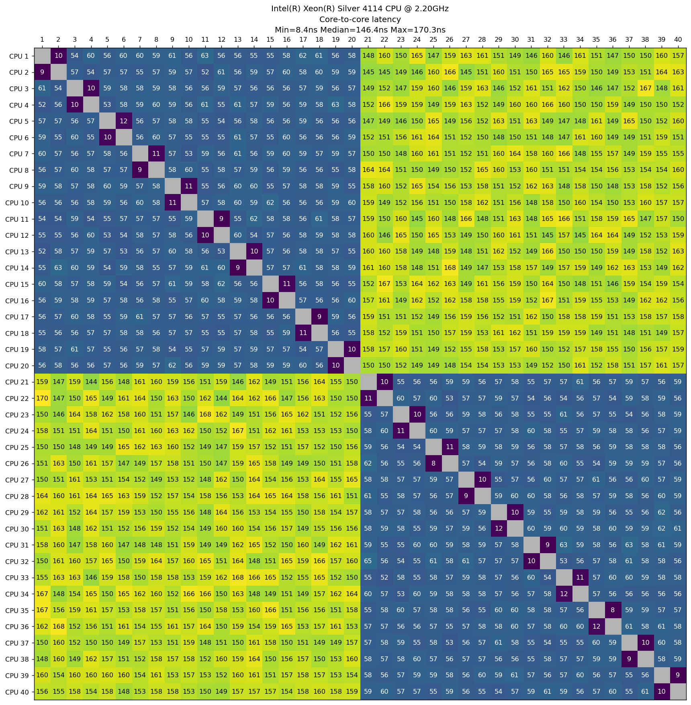
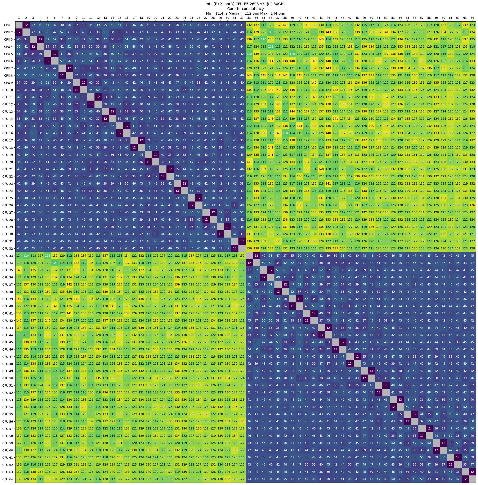

## Measure the CPU latency between cores

This program measures the time (ns) that it takes to send/receive a Compare-And-Swap (CAS) message among all the cores.
In particular, it makes sure to allocate the message in the memory bound to the sending thread. In other words, it's NUMA aware.

_Inspired by [`core-to-core-latency`](https://github.com/nviennot/core-to-core-latency)_

### Usage

```
USAGE: cpu-latency [options]

Measures average the time (ns) that it takes to send/receive a Compare-And-Swap (CAS) message among all the cores
The results are streamed to 'stdout' as a comma-separated values (CSV) format.

OPTIONS:

-rt, --round-trips   <int>   Number of times to send and receive messages from core A to core B              (Default: 1000)
-r,  --repeat        <int>   Number of times to repeat the experiment per core                               (Default: 15)
-s,  --symmetric     <bool>  Whether to measure ping-pong latency from core A to core B but not the oposite  (Default: true)
     --randomize     <bool>  Whether to randomize the order of cores to measure                              (Default: true)
-h,  --help                  Display available options
```

### Build

This program requires the `hwloc` API in order to bind threads and memory. Make sure to have it available on your system, for example:

```
# Ubuntu/Debian
apt-get install libhwloc-dev
```

To build, just configure cmake and build its targets:

```
mkdir cpu-latency/build && cd cpu-latency/build
cmake ..
make
```

### Plot

Make sure to have `numpy` and `matplotlib` in yor system, for example:

```
python3 -m pip install -U matplotlib
python3 -m pip install -U numpy
```

Then you can run the script to measure the latency and plot it with the utility python script

```
./cpu-latency > cpu-latency.csv
./cpu-latency-plot -i cpu-latency.csv -o cpu-latency.png
```

## Why do we need another program for this?
Compared to other programs, this program can:

* Take into account NUMA domains ([main motivation](https://github.com/nviennot/core-to-core-latency/issues/97))
* Randomize order of CPUs to benchmark (it makes a difference!)
* Parameterize the number of round-trips and experiment repetitions
* Choose between symmetric and non-symmetric benchmarks

## Examples

### Intel(R) Core(TM) i7-8565U CPU @ 1.80GHz


### Intel(R) Xeon(R) Silver 4114 CPU @ 2.20GHz - Dual Socket



### Intel(R) Xeon(R) CPU E5-2698 v3 @ 2.30GHz - Dual Socket



### AMD EPYC 7713 64-Core - Dual Socket


